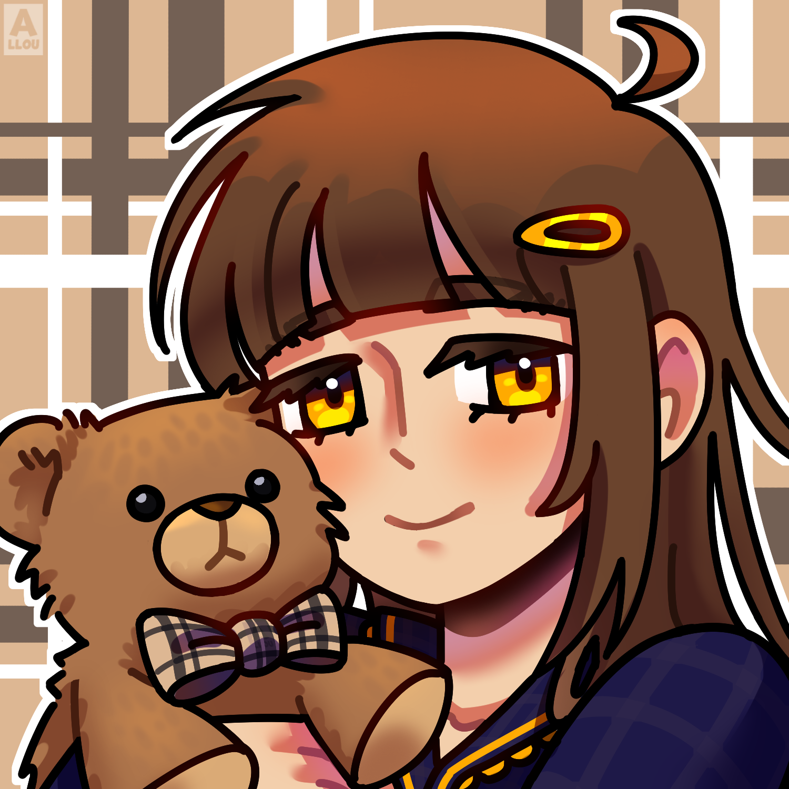

  

  <h1>Maddie, a solução inteligente para seu servidor.</h1>

  
<em>
    Olá! Eu sou a Maddie, sua companheira no Discord, pronta para ajudar com
    economia, moderação e várias utilidades para o seu servidor.
  </em>

  <!-- Badges -->
  

  

  <!-- Links -->
  <a href="https://discord.gg/zaHWNk4jya">Servidor de Suporte</a>
  &nbsp;•&nbsp;
  <a href="https://discord.com/oauth2/authorize?client_id=1436512754386079919">Me adicione em seu servidor!</a>
  &nbsp;•&nbsp;
  <a href="https://top.gg/bot/1436512754386079919/vote">Vote em Mim!</a>

    <h1>🧸 Sobre a Maddie</h1>

